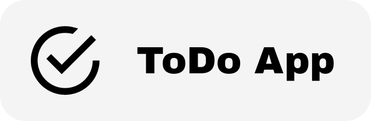
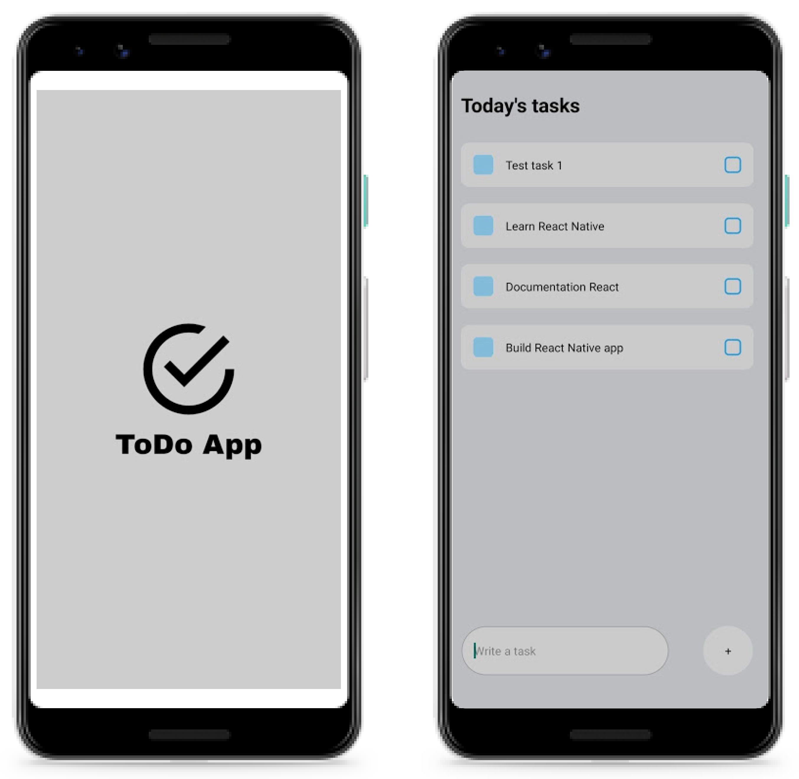
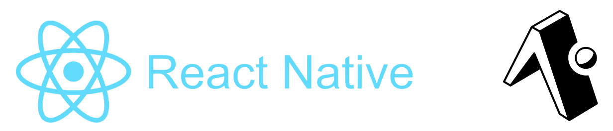

<div align="center">
  
</div>

## ToDo App

[](https://github.com/klayverxd)
[](#)
[](https://reactjs.org)

<h4 align="center">
  Todo App é uma aplicação para organização de tarefas diárias.
</h4>

<div align="center">
  
</div>

## 🧪 Tecnologias
<div align="center">
  <br />
  
</div>

Este projeto foi desenvolvido usando as seguintes tecnologias:

- [React Native](https://reactnative.dev)
- [Expo](https://expo.dev)

## 👨🏽‍💻 Inicialização com Expo

**No terminal, clone o projeto e acesse a pasta da aplicação**

```bash
$ git clone https://github.com/klayverxd/todoList.git && cd todoList
$ expo start
```
